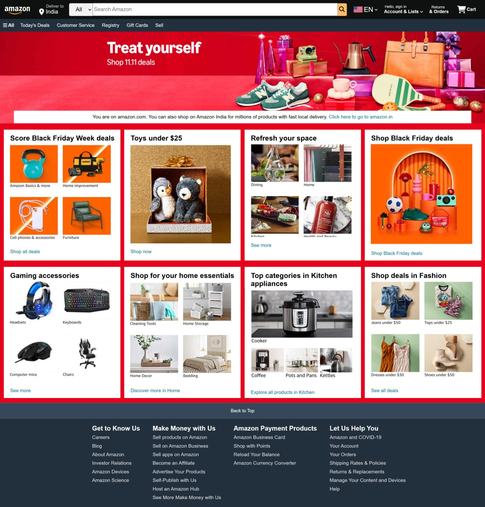
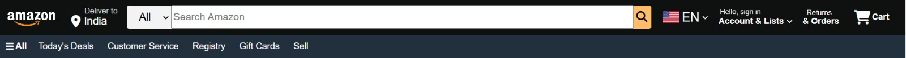
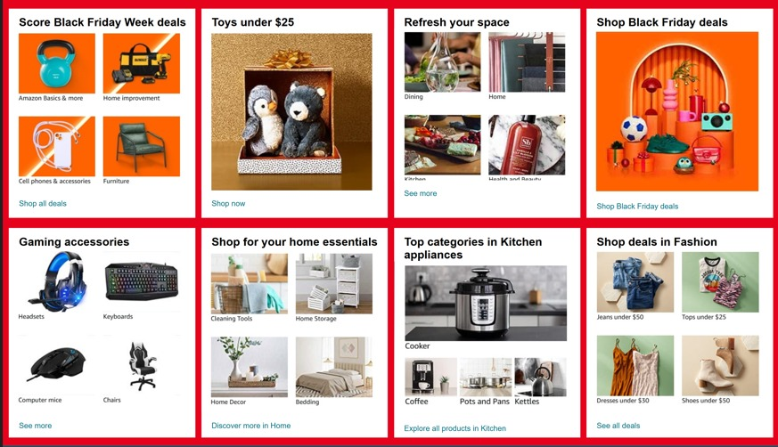
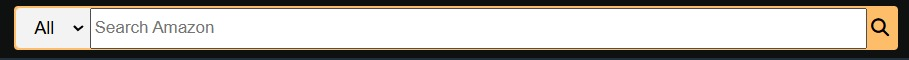

**Amazon Clone**  
This project is a simple clone of Amazon's homepage, showcasing basic features like navigation, search, product categories, and user interaction. It demonstrates how you can create an e-commerce website using HTML and CSS.

**Features**  
Navigation Bar: Contains sections like Deliver to, search bar, language selector, sign-in, orders, and cart.  
Hero Section: A welcoming message with a link to Amazon India for international users.  
Shop Section: Features various categories like Black Friday deals, toys, gaming accessories, home essentials, and more, all styled with images that are dynamically linked.  
Footer Section: A comprehensive footer with links to different Amazon pages like careers, customer service, and payment products.  

**Technologies Used**  
HTML: Basic structure of the webpage.  
CSS: Styling for layout, design, and responsiveness.  

**Live Demo**  
You can explore the live demo of this Amazon Clone below:

https://prapti-gupta-1805.github.io/amazon-clone/

**Screenshots**  
## Full Website Screenshot

## Navbar

## Hero Section

## Shop Section

## Footer

## Hover Effects
### Hover Effect 1

### Hover Effect 2

**License**  
This project is open-source.
